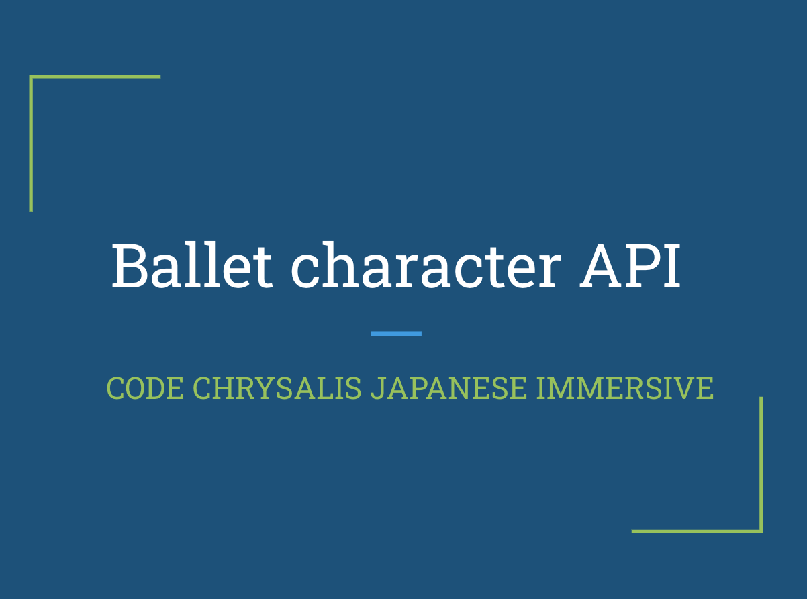
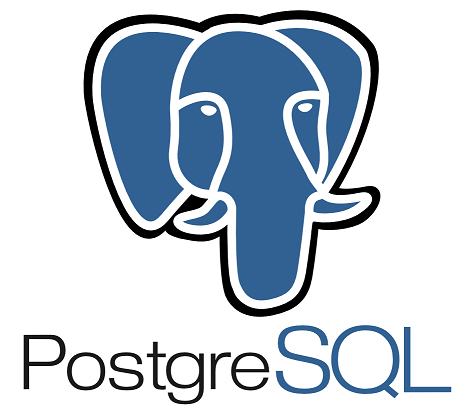

#  BalletCharactersAPI

***

## navigation

1. [ABOUT](#ABOUT)
2. [INSTALLATION](#INSTALLATION)
3. [CREDITS](#CREDITS)
4. [CONTRIBUTING](#CONTRIBUTING)

## ABOUT
このAPIはバレエの物語に出てくるキャラクターのAPIです。
 結果が見えやすくする為にhtmlファイルを用意してそこから操作ができます。
 
**
 

## INSTALLATION
まず最初にこのリポジトリをクローンしてください。
 
`$ git clone https://github.com/ryoutaka/BalletCharactersAPI.git`
 
 
次にクローンしたプロジェクトのルートディレクトリまで移動してください。
 
`cd BalletCharactersAPI`
 
 
データベースを作ってください
 
`$ echo "CREATE DATABASE api;" | psql`
 
 
インストールしてください
 
`yarn`
 
 
migrateコマンドを実行してください
 
`yarn migrate`
 
 
seedコマンドを実行してください
 
`yarn seed`
 
 
使ってみましょう！
 
`yarn start`
  
## CREDITS
このプロジェクトは以下のパッケージを使って作成しました
 
 

 
 

 
 
## CONTRIBUTING
初めて自作したAPI（二日間）なので粗がたくさんあります。Pull Requestお願いします！

